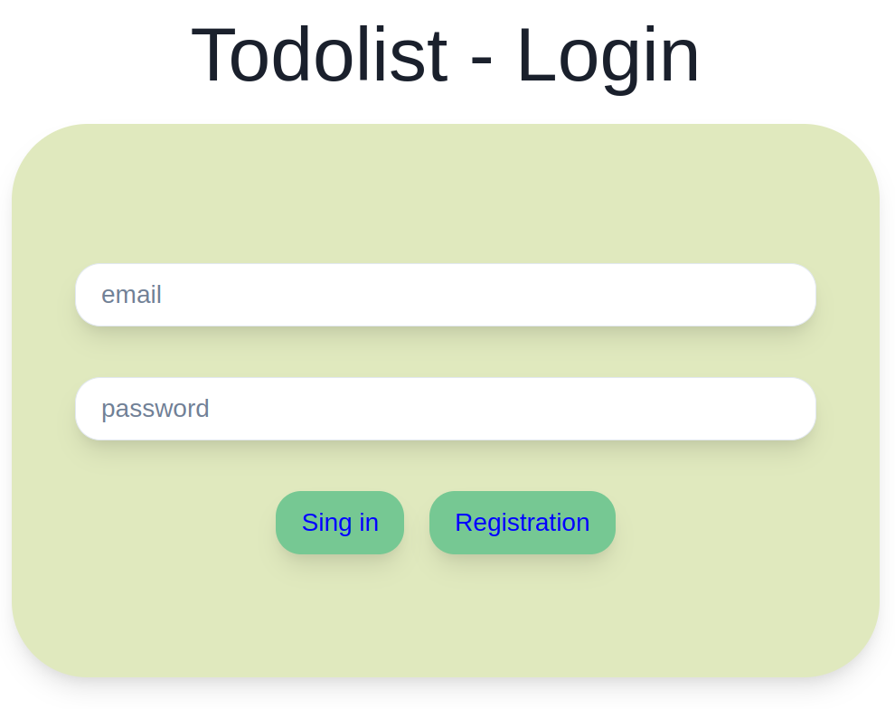
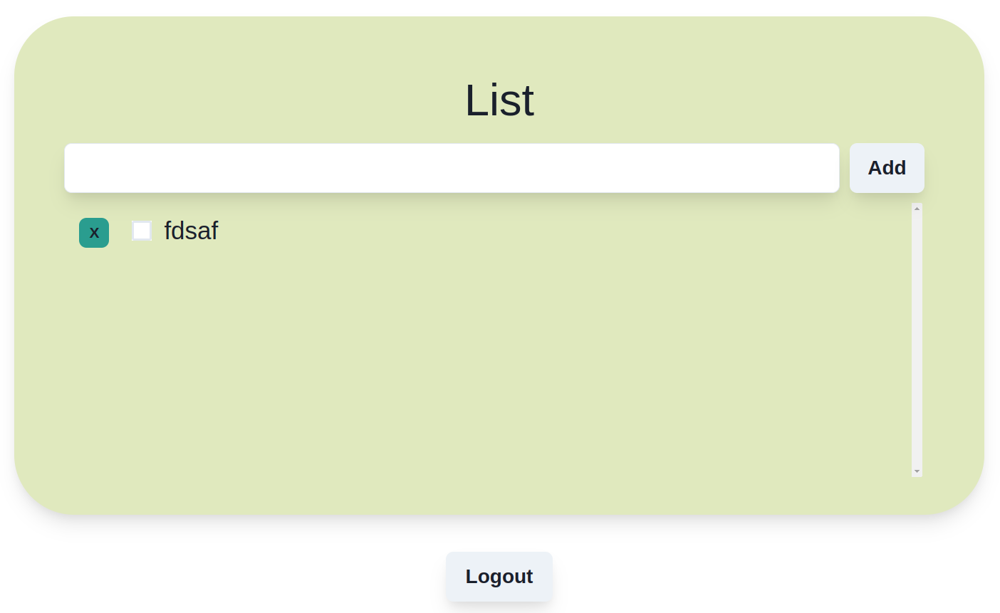
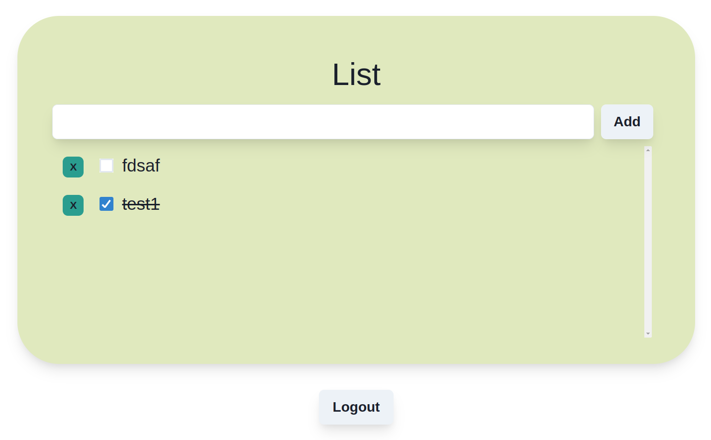
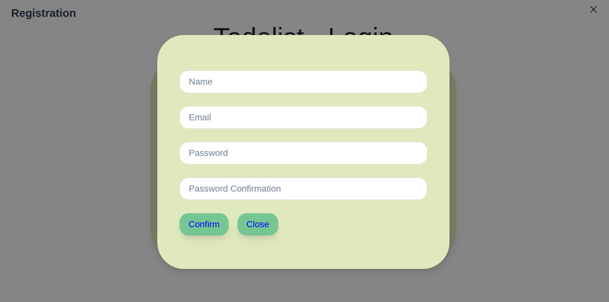

# install and start
Note that backend should be started first:
https://github.com/BaselQq/laravel_todolist_frontend

```bash
npm install
```

```bash
npm start
```


# Photos

## Login


## App





## Registration



# Notes
* Mockups made using figma